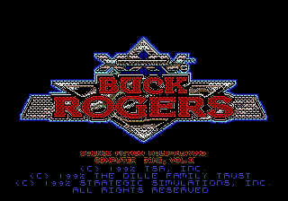
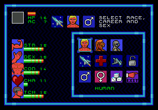
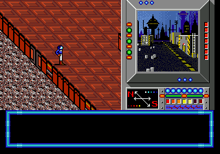
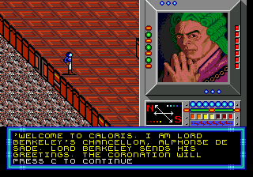
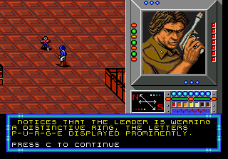
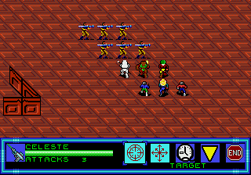

# Buck Rogers: Matrix Cubed — Genesis

Transplanting the DOS scenario *Buck Rogers: Matrix Cubed* (1992) into the
Sega Genesis engine of *Buck Rogers: Countdown to Doomsday* (1991), so the
sequel can be played on the console it never reached.

**Status: work in progress.** The intro and the first level play through
well. Past that it is largely untested — the campaign transplants and the
later areas load, but I have not played them end to end, and given how bugs
have turned up here so far there are certainly more waiting. Treat it as
something to poke at and report, not as a finished cartridge.

Both games run SSI's Gold Box engine. The Genesis one is a port of it, and
the two are close enough that a scenario written for one can be made to run
on the other — but only after every id that crosses between them is
translated, because the engine rarely errors on a wrong id. It indexes off
the end of a table and carries on.

| | |
|---|---|
|  |  |
|  |  |
|  |  |

*Matrix Cubed's* content running on *Countdown to Doomsday*'s Genesis engine:
its title card, its character creation, the Salvation dock, Chancellor de
Sade, the perception check that spots the PURGE ring, and a tactical fight
with the Terrans. Every screenshot is from a ROM this repository builds.

## Why

I was the kid who rented the same game every single time. Same trip to the
video store, same cartridge, *Countdown to Doomsday*, while my sibling sat
through it weekend after weekend. It is still a joke between us decades later.

I wanted more of it, and figured I would have to write the sequel myself —
until I found out somebody already had, in 1992, and it never left DOS.

So this is the attempt to hand the Genesis the other half of the story.
[The longer version is in docs/history.md](docs/history.md), including what
turned out to be hard and which habits were worth keeping.

## Built with AI, steered the whole way

Worth saying plainly: I leaned on AI heavily to do this. Two games' worth of
68000 disassembly, two script formats, an undocumented sound driver and a
tile renderer is more than I was going to read on my own, and most of the
tooling and notes here came out of working through it that way. It can play
the game too — `tools/play.py` drives a build under a scriptable Genesis
core, presses buttons, reads RAM and captures frames, and a great deal was
reproduced and verified that way.

What it needed was steering. Left alone it will produce a confident,
plausible, wrong explanation and carry on: the chancellor greeting the party
twice got two of those before the real cause turned up. Nearly every bug in
here started with me playing, noticing something was off — an elevator drawn
in letters, enemy ships that could not be beaten — and then not accepting the
first answer that came back.

## This repository contains no game data

It is tooling and reverse-engineering notes. Nothing from either game is
committed here, and `.gitignore` refuses `roms/`, `dos_game/` and every
`.gen .DAX .XMI .OVR .EXE .ADV .BNK .CAT`.

**You supply two things, both of which you must already own:**

```
roms/countdown.gen     the Genesis Countdown to Doomsday cartridge, 1 MB
                       -- this is the ENGINE the port runs on

dos_game/matrix/       a Matrix Cubed DOS installation, 51 files
                       -- this is the CONTENT: art, maps, scripts, music,
                          monster and item tables
```

If your DOS copy came as an archive, it already has the right shape inside —
the `.DAX` files sit under `matrix/`, which is exactly where the build looks:

```
unzip <your-matrix-cubed-archive>.zip -d dos_game/
```

`tools/checkinputs.py` will tell you if it landed somewhere else. It searches
for the files it wants, and if it finds them under another name, in another
directory, or still inside an archive, it says where they are and what to run.

Both are needed. Matrix Cubed is a DOS program and contains no Genesis code
at all; Countdown supplies the 68000 engine, the tile renderer and the sound
driver, and the tools here translate one into the other. Nine of those files
are read at build time and each is checked by SHA-1 first:

```
python3 tools/checkinputs.py
```

It names exactly what is wanted and whether yours are the dumps every offset
in `tools/` was measured against. A different revision is a warning, not a
refusal — it may well work.

## Reproducible

The build is a pure function of those inputs. Delete the output, run it
twice, and the two ROMs are byte-identical; nothing is layered on anything
previously extracted.

## Requirements

Python 3.9 or newer, and two packages:

```
python3 -m venv .venv
. .venv/bin/activate
pip install -r requirements.txt
```

That is everything the build needs. `requirements-dev.txt` adds the research
instruments — a scriptable Genesis core, 68000 and Z80 disassemblers, DOSBox
capture — and none of it is required to produce a cartridge.

## Building

```
python3 tools/checkinputs.py                  # are the inputs there and right?
python3 tools/build.py                        # -> roms/matrix_play.gen
python3 tools/boottest.py roms/matrix_play.gen
```

`tools/build.py` is the whole recipe: it transplants the areas, replaces the
boot block, injects artwork, converts the music, maps the ids and repairs
the cartridge checksum. Flags let you bisect — `--no-art`, `--no-music`,
`--no-expand`, `--no-creatures`, `--no-bigpic`, `--no-portrait`.

## Playing it

The output is a 2 MB Genesis ROM at `roms/matrix_play.gen`.

**In an emulator.** Any accurate Mega Drive emulator will run it. Development
was done against BlastEm, and Genesis Plus GX and Kega Fusion work too:

```
blastem roms/matrix_play.gen
```

**On hardware.** 2 MB is within range for a flash cartridge — a Mega EverDrive
or similar — and for anyone burning a real board, 2 MB is four 512 KB masks or
one 16 Mbit device.

**About saving.** The cartridge carries 8 KB of SRAM that the stock header
does not declare, which is how *Countdown to Doomsday* shipped. Emulators
generally cope; if saves do not persist, enable SRAM for the ROM explicitly.
BlastEm writes its save next to its config, and only on a clean exit — killing
the emulator loses the game in memory.

## How the conversion works

**Music** is read straight out of the DOS game at build time. `xmi.py` parses
`BUCKA.XMI`, `xmi2seq.py` converts each song into the Genesis sound driver's
own sequence format, and `inject_music.py` writes them into the cartridge.
Nothing is pre-converted.

**Art** takes one step more, because the DOS pictures are worth keeping in a
lossless form. `extract_images.py` and `extract_images_vd.py` decode the DAX
archives to PNG under `extracted/`, and `inject_portrait.py` quantises those
to the sixteen colours a Genesis palette line gives and injects them. The
build runs the extractors itself when `extracted/` is absent, so a clean
checkout needs no manual step.

That split is deliberate: **the PNGs are the master copies.** The Genesis
conversion is lossy and permanent, so the pipeline always runs original →
target. If you want to redraw something — a portrait the quantiser mangles, a
wall piece the engine has no equivalent for — edit the PNG in `extracted/` and
rebuild; the injectors pick it up. `convert_art.py` bulk-converts the whole
archive so you can see how art will land before committing to it, and
`docs/art_conversion.md` explains what the four palettes can and cannot do.

## What works

Everything below has been seen running. The first level is the part that has
actually been played through repeatedly; the rest is built and loads, but is
not proven.


- **All 33 areas** transplanted, all 78 area transitions intact, 29 of 33
  reachable from the opening (the four that are not are SSI's developer
  menu, its combat test room, an empty stub and the attract demo)
- **4,536 of 4,552 text lines** survive, re-paginated for a window four
  lines shorter than the DOS one
- **The opening plays**: space cutscene, Buck Rogers briefing, the starting
  kit of 8000 credits and 20 items, the dock, the chancellor
- **Music** converted from XMI to the Z80 driver's own sequence format
- **Combat runs** — encounters fire, initiative resolves, experience is
  awarded
- **Matrix Cubed's own 36 creatures** have roster slots and names, with the
  engine's 64-monster ceiling raised to 128
- **27 of the 36 wear their own DOS artwork**, quantised to the sixteen
  colours the engine gives a combat figure and resolved automatically: a DOS
  monster record names its sprite at byte 185 and a creature's two poses are
  blocks `N` and `N+128` of `CPIC1`. The other nine name a block `CPIC1` does
  not have, and keep the Countdown figure they were substituted for, which
  was picked by role and is usually close -- SECURITY ROBOT keeps RAM H.S.
  ROBOT, LOWLANDER keeps LL. WARRIOR
- **A 48x48 creature size**, which the Genesis engine did not have. Stock
  Countdown draws 24x24, 24x48 and 48x24; Matrix Cubed has five creatures
  at 48x48, the Venus Dinosaur among them, and they now draw at full size
  standing on two grid squares by two
- **Space travel and ship-to-ship combat**: the ship launches from the port,
  reaches the star map, and fights. The ship's systems are repaired and
  refuelled at the port, and enemy vessels are drawn from the roster the
  scripts actually name

## What does not, yet

- **Wall codes are an unmapped id space.** A wall value selects a piece from
  the loaded set, and the two games disagree about what each value means.
  Matrix Cubed has fifteen distinct walls; set 1 collapses four of its codes
  onto the same Countdown piece, which is why a corridor can repeat. The
  measurement is in `docs/re_notes.md`; what is missing is the correspondence
  between the two games' pieces
- **The transpiler emits every memory operand one byte wide**, though DOS
  encodes the width in its type byte. 41 addresses are used two or four bytes
  wide. Fixing it needs `flagmap` to reserve room for them first
- Creatures animate between two poses only, because that is all a DOS block
  holds; a real walk cycle needs the frame grouping in `docs/art_todo.md`
- Matrix Cubed presents its ports as a menu, where the Genesis engine could
  let you walk them as the opening dock already does. That is content work
  rather than reverse engineering
- Three instructions in SSI's developer block still do nothing

## Layout

```
docs/re_notes.md    the reverse engineering: formats, addresses, what was
                    measured and what is still a guess
docs/devlog.md      what happened, including what was wrong and why
docs/history.md     how the project started and why it is built this way
tools/              101 programs. `build.py` is the entry point and the whole
                    recipe. 55 of them are reachable from it -- the injectors,
                    the id maps, the codecs. The other 46 are research
                    instruments that never touch the output ROM: play.py
                    drives a build under an emulator, areacheck.py grades every
                    transplanted area, levelmap.py prints the game's level
                    graph, dump_ecl.py disassembles scripts
tests/              unit tests for the codecs
```

## Verifying

`tools/play.py` drives a build under a scriptable Genesis core: it presses
buttons, reads RAM and captures frames. It boots, loads the pregenerated
team, plays the opening and walks the dungeon, which is how the map and the
party's start square are checked without anyone watching. It cannot fight,
so it stalls at the first encounter.

`tools/boottest.py` is the cheap version: does the ROM boot, reach the menu,
and still carry its cartridge serial.

## Credit

*Countdown to Doomsday* and *Matrix Cubed* are SSI's, from TSR's Buck Rogers
setting. This project distributes neither. It is a conversion tool for
people who own both.
